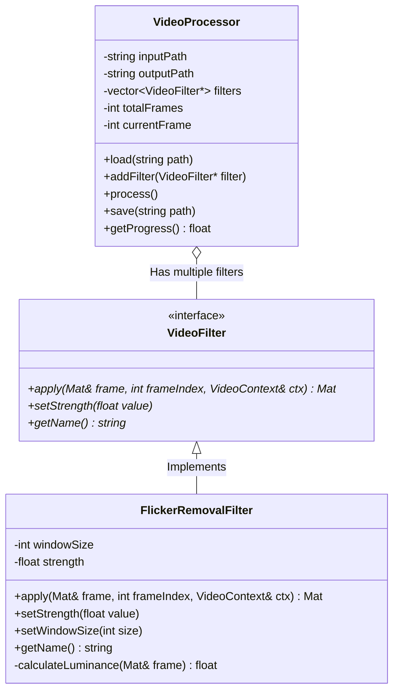

# フリッカー除去ツール (Flicker Removal Tool)

このプロジェクトは、動画や連番画像の輝度フリッカー（チカチカする現象）を除去するC++アプリケーションです。OpenCVで動画処理を行い、ImGuiでパラメータの調整やプレビューを行います。

## 機能概要
- 動画ファイル (.mp4, .avi など) または連番画像の読み込み
- Luminance Smoothing (輝度移動平均) アルゴリズムによるフリッカー除去
- フリッカー除去の「ウィンドウサイズ(適用範囲)」と「ブレンド強度」の調整
- ImGuiによる処理状況のプログレス表示とリアルタイムプレビュー

## アーキテクチャ (クラス図)

---

... (環境構築の解説などは前述参照)
